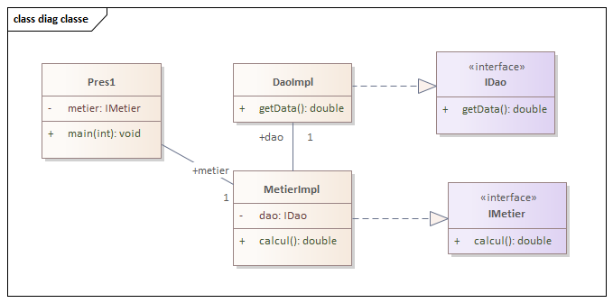
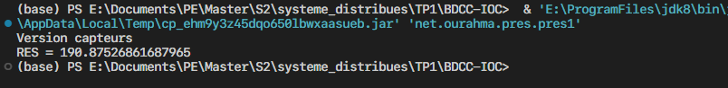
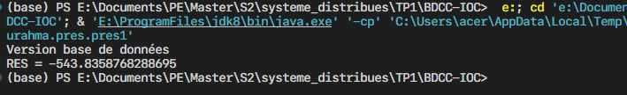
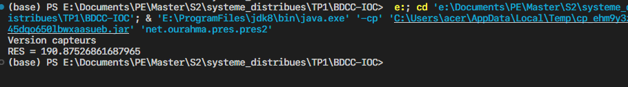
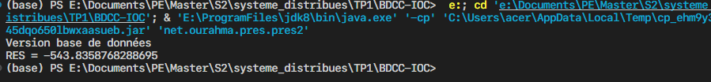
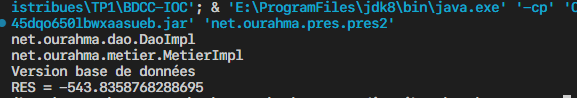
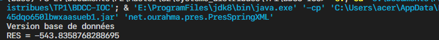
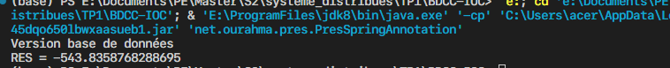

# BDCC-IOC
## Rapport de TP 1
* Nom : OURAHMA.
* Prènom : Maroua.
* Filière : Master en Intelligence artificielle et sciences de données
* Universitè : Facultès des sciences Universitè Moulay Ismaol Meknès.

## **1- Introduction**

Ce rapport a pour objectif de présenter le résultat lors de TP d'injection des dépendances.

## **2- Enoncé**

Ce projet a pour but de démontrer l'évolution de l'instanciation d'objets en Java, en mettant en œuvre trois approches différentes :

### 1. Instanciation Classique
Création manuelle des objets à l’aide du mot-clé `new`. Cette approche met en évidence une forte dépendance entre les classes et un couplage rigide.

### 2. Instanciation Dynamique Simple
Remplacement de l’instanciation manuelle par une instanciation dynamique basée sur la lecture des noms de classes :
- soit depuis un fichier texte (`.txt`),
- soit en les saisissant via la console à l’aide de `Scanner`.

Cette méthode permet une meilleure flexibilité sans modifier directement le code source.

### 3. Intégration avec le Framework Spring
Transformation du projet pour utiliser **Spring** et appliquer le principe SOLID **"Open/Closed"** (ouvert à l’extension, fermé à la modification) :
- **Version XML** : configuration des dépendances à l’aide d’un fichier `config.xml`.
- **Version avec Annotations** : utilisation des annotations Spring telles que `@Component`, `@Autowired`, etc., pour gérer les dépendances de manière plus concise et moderne.

## Objectifs pédagogiques

- Comprendre les différentes méthodes d’instanciation en Java.
- Apprendre à externaliser la configuration des dépendances.
- Appliquer les principes de conception orientée objet avec Spring.
- Comparer les avantages et inconvénients de chaque approche.

## **3- Conception**

La conception (diagramme de classe )de projet en utilisant le logiciel `Entreprise architect` :




## **4- Code source**

- **L'interface IDao**:

```
package net.ourahma.dao;

public interface IDao {
    double getData();
}

```

- **La classe DaoImpl**:

```
package net.ourahma.dao;

import org.springframework.stereotype.Component;
import org.springframework.stereotype.Repository;

@Repository("d")
public class DaoImpl implements IDao {
    @Override
    public double getData() {
        System.out.println("Version base de données");
        double t = 34;
        return t;
    }
}


```
-**La classe DaoImplV2 dans le package net.ourahma.ext**

```
package net.ourahma.ext;

import net.ourahma.dao.IDao;
import org.springframework.stereotype.Component;
import org.springframework.stereotype.Repository;

@Repository("d2")
public class DaoImplV2 implements IDao {
    @Override
    public double getData() {
        System.out.println("Version capteurs");
        double t =12;
        return t;
    }
}

```
- **L'interface IMetier**:

```
package net.ourahma.metier;

public interface IMetier {
    double calculer();
}


```

- **La classe MetierImpl**:

```
package net.ourahma.metier;

import net.ourahma.dao.IDao;
import org.springframework.beans.factory.annotation.Autowired;
import org.springframework.beans.factory.annotation.Qualifier;
import org.springframework.stereotype.Component;
import org.springframework.stereotype.Service;

@Service("metier")
public class MetierImpl implements IMetier {
    @Autowired
    @Qualifier("d")
    private IDao dao; // le fait de dépendre de l'interface et le couplage faible
    @Override
    public double calculer() {
        double t = dao.getData();
        double res = t * 12 * Math.PI/2 * Math.cos(t);
        return res;
    }
    /*
     pour injecter dans la variable dao une classe qui implèmente l'interface IDao
     au moment de la création de l'objet
     */
    public MetierImpl(@Qualifier("d") IDao dao) {
        this.dao = dao;
    }

    //public MetierImpl() {}

    /*
     pour injecter dans la variable dao une classe qui implèmente l'interface IDao
     après instantiation
     */
    public void setDao(IDao dao) {
        this.dao = dao;
    }
}


```
-**La classe Pres1 dans la pckage net.ourahma.pres**
    Cette classe a pour but de faire l'instanciation classique des objects.
```
package net.ourahma.pres;

import net.ourahma.dao.DaoImpl;
import net.ourahma.ext.DaoImplV2;
import net.ourahma.metier.MetierImpl;

public class pres1 {
    public static void main(String[] args) {
        DaoImplV2 d = new DaoImplV2();
        MetierImpl metier = new MetierImpl(d);
        // en fait l'injection de dépendances
        //metier.setDao(d); injection de dépendances via le setter
        System.out.println("RES = "+metier.calculer());
    }
}

```

-**La classe Pres2 dans la pckage net.ourahma.pres**
    Cette classe a pour but de faire l'instanciation dynamique des objects.
```
package net.ourahma.pres;

import net.ourahma.dao.IDao;
import net.ourahma.metier.IMetier;

import java.io.File;
import java.io.FileNotFoundException;
import java.lang.reflect.InvocationTargetException;
import java.lang.reflect.Method;
import java.util.Scanner;

public class pres2 {
    // FileNotFoundException, ClassNotFoundException, InstantiationException, IllegalAccessException, NoSuchMethodException, InvocationTargetException 
    public static void main(String[] args) throws Exception{
        // lire le fichier
        Scanner scanner = new Scanner(new File("config.txt"));

        //lire le nom de la classe
        String docClassName = scanner.nextLine();
        /*
        créer un objet de la classe
        en premier en charge la classe dans la mémoire
         */
        Class cDao = Class.forName(docClassName);
        // créer l'objet
        IDao dao = (IDao) cDao.newInstance();
        //System.out.println(dao.getData());

        // faire la meme chose pour l'objet matier
        String metierClassName = scanner.nextLine();
        Class cmetier = Class.forName(metierClassName);
        IMetier metier = (IMetier) cmetier.getConstructor(IDao.class).newInstance(dao);
        /*IMetier metier = (IMetier) cmetier.getConstructor().newInstance();
        Method setDao = cmetier.getMethod("setDao", IDao.class);
        setDao.invoke(metier, dao);*/
        System.out.println("RES = " + metier.calculer());
    }
}
```

-**La classe PresSpringXML dans la pckage net.ourahma.pres**
    Cette classe a pour but de faire l'instanciation en utilsiant la le framework spring avec la version basée sur le fichier XML.
```
package net.ourahma.pres;

import net.ourahma.metier.IMetier;
import org.springframework.context.ApplicationContext;
import org.springframework.context.support.ClassPathXmlApplicationContext;

public class PresSpringXML {
    public static void main(String[] args) {
        ApplicationContext context = new ClassPathXmlApplicationContext("config.xml");
        IMetier metier = (IMetier) context.getBean("metier");
        System.out.println("RES = "+metier.calculer());
    }
}
```

-**La classe PresSpringAnnotation dans la pckage net.ourahma.pres**
    Cette classe a pour but de faire l'instanciation en utilsiant la le framework spring en se basant cette fois sur les décorateurs dans le classes DaoImpl, DaoImplV2 et MetierImpl.
```
package net.ourahma.pres;

import net.ourahma.metier.IMetier;
import org.springframework.context.ApplicationContext;
import org.springframework.context.annotation.AnnotationConfigApplicationContext;

public class PresSpringAnnotation {
    public static void main(String[] args) {
        // créer les objet en se basant sur les components
        ApplicationContext applicationcontext =  new AnnotationConfigApplicationContext("net.ourahma");

        IMetier metier = applicationcontext.getBean(IMetier.class);
        System.out.println("RES = "+metier.calculer());
    }
}


```

- **Le fichier XML  utilisé pour déclarer des Beans**

    Ce fichier doit être créer dans le dossier ressources après ajout de les dependencies dans le fichier `pom.xml`

```
<?xml version="1.0" encoding="UTF-8"?>
<beans xmlns="http://www.springframework.org/schema/beans"
       xmlns:xsi="http://www.w3.org/2001/XMLSchema-instance"
       xsi:schemaLocation="http://www.springframework.org/schema/beans http://www.springframework.org/schema/beans/spring-beans.xsd">
<bean id="d" class="net.ourahma.dao.DaoImpl"></bean>
    <bean id="metier" class="net.ourahma.metier.MetierImpl">
        <!--property name="dao" ref="d"></property-->
        <constructor-arg ref="d"></constructor-arg>
    </bean>
</beans>

```
## **5- Captures écrans**

- **Exécution de la classe Pres1 (instanciation classique)**

    - **En cas d'utilisation de la version DaoImplV2 (version capteurs)**

    

    - **En cas d'utilisation de la version DaoImpl (version base de données)**

    

- **Exécution de la classe Pres2 (instanciation dynamique)**

    En faisant l'instantiation après lire de fichier.

    A ce point là l'instanciation est fait en utilisant le fichier `config.txt`, pour changer entre les versions il s'agit de changer le nom de la classe dans le fichier `config.txt`.
    - **En cas d'utilisation de la version DaoImplV2 (version capteurs)**

    

    - **En cas d'utilisation de la version DaoImpl (version base de données)**

    

    En insérant le nom de la classe avec `System.in`:

    

- **Exécution de la classe PresSpringXML  (injection des denpandances)**

    Pour changer la version de la classe il s'agit de changer la classe dans le fichier `config.xml`:
    **Version base de données en utilisant le constructeur dans la classe MetierImpl**

    

    **En travaillant avec `property` au lieu `constructor-arg`**

    Pour ce faire il faut dé-commenter le constructeur par défaut pour utiliset le setter au lieu de constructeur.

    ```
    <bean id="metier" class="net.ourahma.metier.MetierImpl">
        <property name="dao" ref="d"></property>
        <!-- <constructor-arg ref="d"></constructor-arg> -->
    </bean>
    ```

- **Exécution de la classe PresSpringSpringAnnotation  (injection des denpandances)**

    Pour utiliser les annotations il faut ajouter des décorrateurs dans les classes MetierImpl, DaoImpl et DaoImplV2. 

    ```
    @Service("metier")
    public class MetierImpl implements IMetier {
        @Autowired
        @Qualifier("d")
        private IDao dao;
    }

    public MetierImpl(@Qualifier("d") IDao dao) {
        this.dao = dao;
    }

    public MetierImpl() {}

    ```
    ```
    @Repository("d2")
    public class DaoImplV2 implements IDao {
    // reste de code
    }
    ```

    ```
    @Repository("d")
    public class DaoImpl implements IDao {
        //reste de code
    }
    ```
    - L'annotation @Qualifier("d") précise que Spring doit utiliser le bean nommé "d" (parmi plusieurs implémentations possibles de IDao).
    - L'injection via un constructeur consiste à passer les dépendances requises en tant que paramètres lors de l'instanciation de la classe. Cela garantit que toutes les dépendances nécessaires sont fournies au moment de la création de l'objet.
        - L'annotation @Qualifier("d") spécifie que le bean nommé "d" doit être utilisé.
    
    **Le résultat:**

    


## **6- Conclusion**

En conclusion, ce projet illustre de manière progressive et structurée les concepts fondamentaux de l'injection de dépendances. Il commence par une approche classique basée sur l'instantiation manuelle, avant d'évoluer vers des méthodes plus dynamiques et flexibles. Ensuite, il explore en profondeur l'utilisation du framework Spring, en mettant en œuvre ses deux principales variantes de configuration : XML pour une définition explicite des beans, et annotations pour une approche plus concise et moderne. Cette progression permet de comprendre non seulement les mécanismes sous-jacents de l'injection de dépendances, mais aussi les avantages offerts par Spring en termes de modularité, testabilité et maintenabilité des applications. Ce projet sert ainsi de base solide pour maîtriser les bonnes pratiques de développement dans un environnement orienté vers l'inversion de contrôle (IoC).

## **7- Auteur**

- **Nom:**  OURAHMA
- **Prénom:** Maroua
- **Courriel:** [Email](mailto:marouaourahma@gmail.com)
- **LinkedIn:** [Linkedin](www.linkedin.com/in/maroua-ourahma)